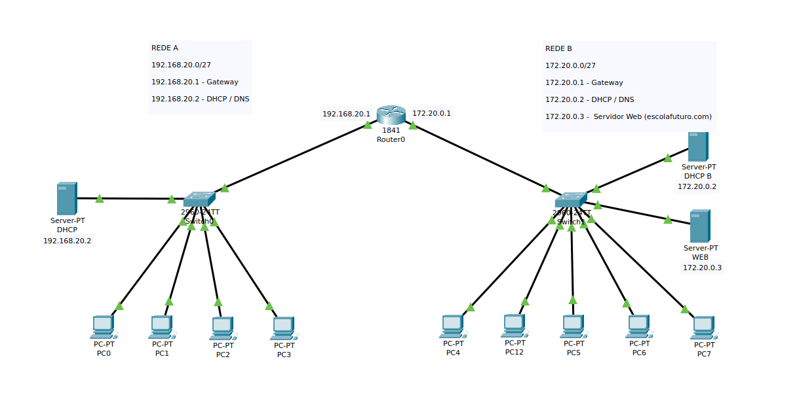

# Projeto Redes 

# Visão Geral
#### Avaliação final do módulo de Redes do Bootcamp Vem Ser Tech - DevOps.
Este projeto, desenvolvido no **Packet Tracer**, tem como objetivo criar e integrar duas redes distintas(Rede A e Rede B), permitindo a comunicação entre elas por meio do protocolo ICMP. As redes são configuradas com diferentes subnets, gateways, servidores DHCP, DNS e servidor web. 

## Topologia da Rede
|   | Subnet | Gateway | DHCP / DNS  | WEB |
|:---|:---:|:---:|:---:|:---:|
|  **Rede A** |  192.168.20.0 /27 |  192.168.20.1 | 192.168.20.2  | - |
|  **Rede B** | 172.20.0.0 /27  | 172.20.0.1  | 172.20.0.2  | 172.20.0.3  |

### Equipamentos Rede A:

* 4 Desktops PC-PT
* 1 Servidor DHCP/DNS - Server PT
* 1 Switch 2960 24TT
* Roteador Cisco 1841 (Gateway)

### Equipamentos Rede B:

* 5 Desktops PC-PT
* 1 Servidor DHCP/DNS - Server PT
* 1 Servidor WEB - Server PT
* 1 Switch 2960 24TT
* Roteador Cisco 1841 (Gateway)
 

## Tecnologia Utilizada
Packet Tracer v.8.2.1.0118

## Configuração

